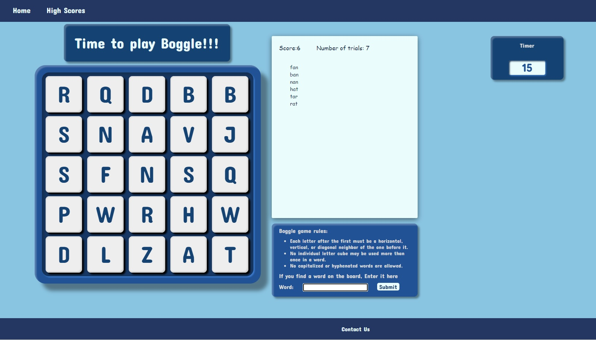
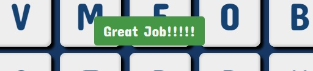
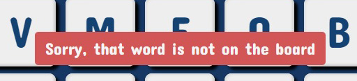
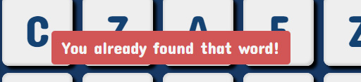

# boggle

## About The Project
**Boggle game is a fun word finding game**
This project was created using Python, JavaScript, CSS and HTML. 
- Backend of the application is created using python module Flask which is a web application framework.
- Fontend is handled with JavaScript and AJAX Javascript library for handling frontend http requests. 
- CSS handles all of the styling of the application.

## Game Rules:
When the user enters the home page the timer starts counting down from 60 seconds. 
During that time user needs to find any many words as possible by using the letters on the game board cubes. 
- Words must be at least three letters in length.
- Each letter after the first must be a horizontal, vertical, or diagonal neighbor of the one before it.
- No individual letter cube may be used more than once in a word.
- No capitalized or hyphenated words are allowed.
When the timer runs out user score will be sent to backend and will be stored in cookies using flask session.
User can view their scores on a "High Scores" page.
Each time the user visits the page their visit is recorded in cookies using flask session and then displayed in "Number of Trials"

## Feedback messages for the user:
During the game user recieves feedback messages based on the words they enter.
These messages are handled by JavaScript and AJAX Javascript library. 
Each message is set to disapear after 3 seconds. 

At the end of the game user also recieves the message that time is up indicating that the game is over. 
User input field and submit buttons are disabled at this time to prevent any further user inputs. 

